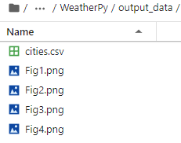
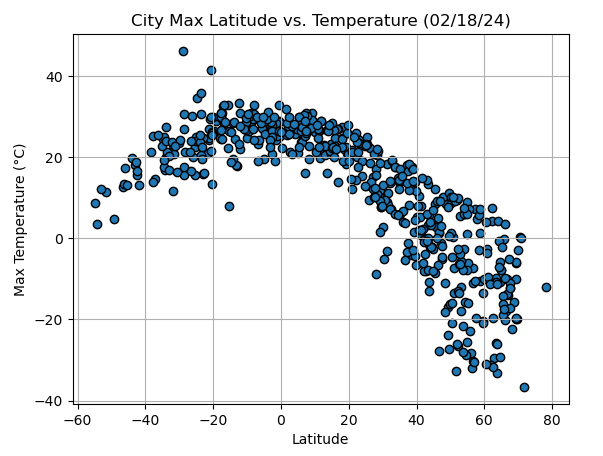
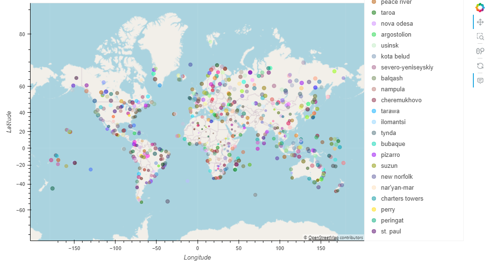

# Python-api-challenge

This project involves analyzing weather data from different cities around the world. Data such as temperature, humidity, wind speed, and cloudiness is collected using the OpenWeatherMap API. Then, visualizations and statistical analyses are performed to explore the relationship between these variables and the latitude of the cities.

# Project Setup
To run this project, you'll need to install Python 3 and some additional libraries. You can install the dependencies by running the following command:

Bash

pip install -r requirements.txt
Additionally, you'll need to obtain an API key from OpenWeatherMap and Geoapify to access their services. You should create an api_keys.py file in the root folder of the project and add your API keys as follows:

Python:

File api_keys.py

OpenWeatherMap API Key
weather_api_key = "YOUR_OPENWEATHERMAP_API_KEY"

Geoapify API Key
geoapify_key = "YOUR_GEOAPIFY_API_KEY"

# Project Structure

- WeatherPy.ipynb and VacationPy.ipynb: Jupyter Notebook containing the Python code for data collection, analysis, and visualizations.

- Output_data: Folder containing output data generated by the project.

- Images: Folder containing images used in the README file or generated by the project.

# Running the Project

To run the project, simply open the WeatherPy.ipynb and VacationPy.ipynb file in Jupyter Notebook.

# Results

The project generates various visualizations and statistical analyses, including:

- Scatter plots of temperature, humidity, wind speed, and cloudiness versus latitude.

- Linear regressions to analyze the relationship between latitude and meteorological variables.

- Maps showing the location of the analyzed cities and weather information.

# References

-- https://www.python.org/

-- https://openweathermap.org/

-- https://myprojects.geoapify.com/projects

-- https://pypi.org/project/citipy/

-- https://matplotlib.org/stable/

-- https://git.bootcampcontent.com/University-of-Adelaide/UADEL-VIRT-DATA-PT-12-2023-U-LOLC

-- https://holoviews.org/user_guide/Tabular_Datasets.html

